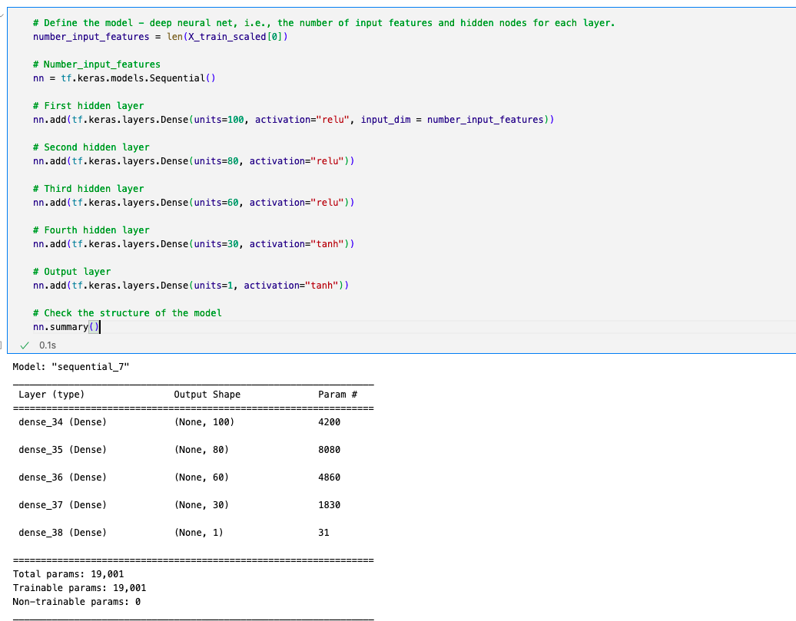
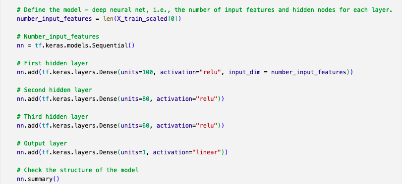
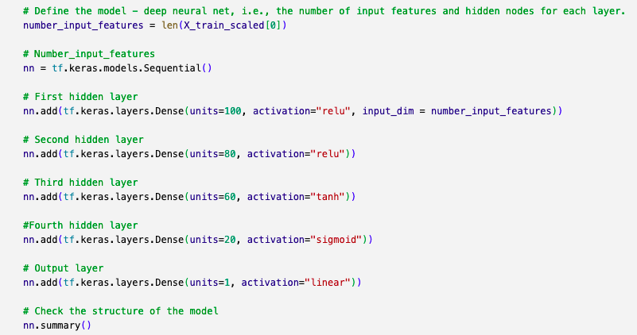
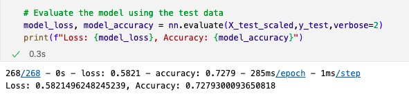

# Neural Network Charity Analysis

## Overview

AlphabetSoup, an organization, wants to be able to predict where to make investments. By using data from from previous sucessful fundings and charitable donations, the analysis will dive into 34,000 organizations that had a sucessful capture of metadata from their past successes. The purpose of this analysis is to utilize deep-learning neutral networks and the TensorFlow platform to analyze and predict whether or not applicants will be successful if funded by AlphabetSoup.

## Results

### Data Preprocessing

-What variable(s) are considered the target(s) for your model?
If the target is marked as sucessful in the DataFrame, indicating that it was sucessfully funded by AlphabetSoup.

-What variable(s) are considered to be the features for your model?
The IS_SUCESSFUL column was the chosen feature for this dataset.

-What variable(s) are neither targets nor features, and should be removed from the input data?
The EIN and NAME columns were removed as they will not increase accuracy, and removing them can help improve efficiency. 

### Compiling, Training, and Evaluating the Model

-How many neurons, layers, and activation functions did you select for your neural network model, and why?

In the first test of the optimized model, layer 1 had 100 neurons with a relu activation. Layer 2 dropped to 80 neurons and continued with the relu activation, and layer 3 dropped down to 60 neurons and continued as well with the relu activation. The fourth layer dropped down further to 30 neurons and had a tanh activation.

In the second test of the optimized model, layer 1 had 100 neurons with a relu activation. Layer 2 dropped to 80 neurons and continued with the relu activation, and layer 3 dropped down to 60 neurons and continued with the relu activation. 

In the third test of the optimized model, layer 1 started with 100 neurons and a relu activation. Layer 2 dropped down to 80 neurons and continued with the relu activation. Layer 3 had 60 neurons and tanh activation, while Layer 4 possessed 30 neurons and a sigmoid activation. 

-Were you able to achieve the target model performance?

The target for the model was 75%, however the highest any of the models produced was 72.8% on Test 2.

-What steps did you take to try and increase model performance?

Different columns were reviewed to see if they would increase the accuracy, and the STATUS and SPECIAL_CONSIDERATIONS columns were dropped. Different amounts of layers and neurons were tested, as well as different activations within the layers as well. 

 ## Summary
 
Based on the results of this deep learning model, the relu activations in Test #2 yielded 72.8% accuracy. Considering the goal was 75% accuracy, this model is not performing where it should be. 
 
Another model that could be used to solve this classification problem would be the RandomForest Classifier Model, as the multitude of decision trees that generate a classified output would be more useful in this binary classification situation. 
